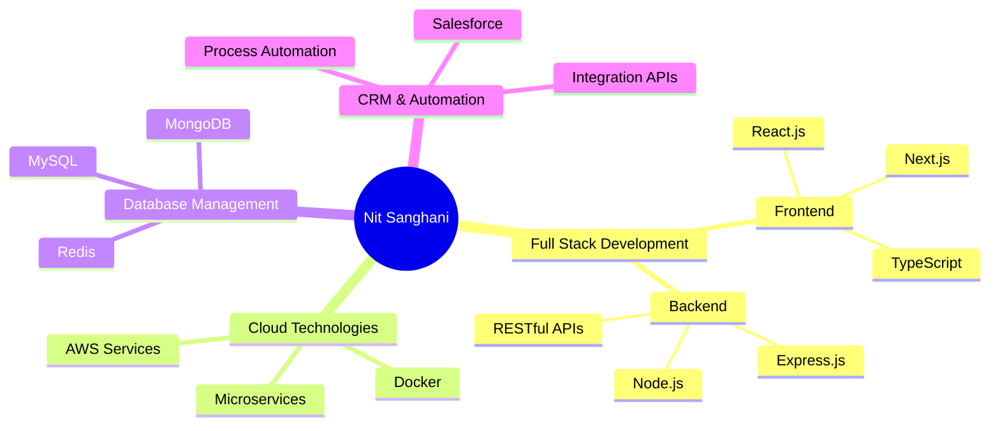

# Hi there, I'm **Nit Sanghani** 👨‍💻

<div align="center">
  
[](https://git.io/typing-svg)

</div>

<p align="center">
  
  
</p>

---

## 🎓 **About Me**

```typescript
const developer = {
    name: "Nit Sanghani",
    education: "B.Tech Computer Engineering @ Marwadi University",
    location: "Gujarat, India",
    specialization: ["MERN Stack", "Salesforce CRM", "Cloud Microservices"],
    currentFocus: "Building scalable web applications",
    philosophy: "Clean code is not written by following a set of rules. 
                 You know when you've written clean code when you see it.",
    availability: "Open for opportunities and collaborations"
};
```

<div align="center">

### 📫 **Connect With Me**

[](mailto:nitsanghani05@gmail.com)
[](https://www.linkedin.com/in/nitsanghani)
[](https://github.com/nitsanghani)
[](https://leetcode.com/nitsanghani/)
[](#)

</div>

---

## 🛠️ **Technology Arsenal**

<details>
<summary><b>💻 Programming Languages</b></summary>
<br>


</details>

<details>
<summary><b>🎨 Frontend Development</b></summary>
<br>


</details>

<details>
<summary><b>⚙️ Backend Development</b></summary>
<br>


</details>

<details>
<summary><b>🗄️ Databases & Storage</b></summary>
<br>


</details>

<details>
<summary><b>☁️ Cloud & DevOps</b></summary>
<br>


</details>

<details>
<summary><b>🔧 Development Tools</b></summary>
<br>


</details>

---

## 🚀 **Featured Projects**

<table>
<tr>
<td width="50%">

### 🏭 [Shashvat Brass Industries](https://shashvatenterprise.com)
**Professional Business Website**

```yaml
Tech Stack: React.js, Node.js, Express
Features:
  - Product showcase with dynamic filtering
  - Contact management system
  - Responsive design across all devices
  - SEO optimized
  - Performance metrics: 95+ Lighthouse score
```

[](https://shashvatenterprise.com)

</td>
<td width="50%">

### 🎓 [Dasharam School Management](https://dasaram.pages.dev)
**Complete Educational ERP System**

```yaml
Tech Stack: MERN Stack, JWT Authentication
Features:
  - Student & Staff CRUD operations
  - Attendance tracking system
  - Fee management module
  - Real-time notifications
  - Role-based access control
```

[](https://dasaram.pages.dev)

</td>
</tr>
<tr>
<td width="50%">

### 🏥 [Hospital Management System](https://github.com/nitsanghani/Hospital-Management)
**Comprehensive Healthcare Platform**

```yaml
Tech Stack: MERN Stack, Razorpay, Socket.io
Features:
  - Doctor verification system
  - Appointment scheduling (Emergency/Normal)
  - Payment gateway integration
  - Real-time chat system
  - Medical records management
```

[](https://github.com/nitsanghani/Hospital-Management)

</td>
<td width="50%">

### 🛒 [E-Commerce Platform](https://github.com/nitsanghani)
**Full-Stack Shopping Solution**

```yaml
Tech Stack: Next.js, Stripe API, MongoDB
Features:
  - Product catalog with search & filters
  - Shopping cart & wishlist
  - Secure payment processing
  - Order tracking system
  - Admin dashboard
```

[](https://github.com/nitsanghani)

</td>
</tr>
</table>

---

## 📊 **GitHub Analytics**

<div align="center">
  


</div>

<div align="center">
  
[](https://git.io/streak-stats)

</div>

---

## 🏆 **Achievements & Recognition**

<div align="center">

[](https://github.com/ryo-ma/github-profile-trophy)

</div>

### 🎯 **Coding Challenges**

<div align="center">


</div>

---

## 📈 **Activity Graph**

<div align="center">

[](https://github.com/ashutosh00710/github-readme-activity-graph)

</div>

---

## 💼 **Professional Experience & Skills**

<div align="center">

### 🎯 **Core Competencies**



</div>

### 📋 **Current Learning Path**

- 🔄 **Advanced React Patterns** - Compound Components, Render Props
- ☁️ **AWS Certification** - Solutions Architect Associate
- 🤖 **AI/ML Integration** - TensorFlow.js, OpenAI APIs
- 🔒 **Cybersecurity** - OWASP, Secure Coding Practices

---

## 🎨 **Design Philosophy**

> *"The best code is not just functional, it's readable, maintainable, and scalable. Every line should tell a story."*

### 🏗️ **Architecture Principles**
- **Modular Design**: Building reusable, independent components
- **Scalability First**: Designing for growth from day one
- **Security by Design**: Implementing security at every layer
- **Performance Optimization**: Fast, efficient, and user-friendly applications

---

## 🤝 **Let's Collaborate**

<div align="center">

### 💬 **Open for Opportunities**

| Area | Status |
|------|--------|
| 🚀 **Full-time Roles** | ✅ Available |
| 💼 **Freelance Projects** | ✅ Available |
| 🤝 **Open Source** | ✅ Active Contributor |
| 🎓 **Mentoring** | ✅ Available |

</div>

---

<div align="center">

### 🌟 **"Code is poetry written for machines to understand and humans to maintain"**

[](https://www.linkedin.com/in/nitsanghani)
[](mailto:nitsanghani05@gmail.com)


</div>
